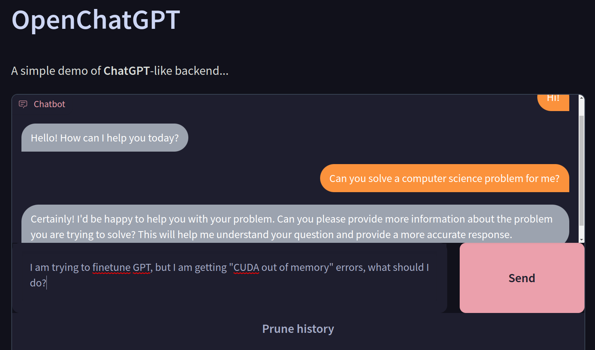

# openchatgpt-gradio
ChatGPT like backend in Gradio

# Shoutouts

 * [gh:oobabooga/text-generation-webui](https://github.com/oobabooga/text-generation-webui) for letting me know that `gr.Chatbot` exists LULW
 * **OpenAI** for ChatGPT and GPT in general.